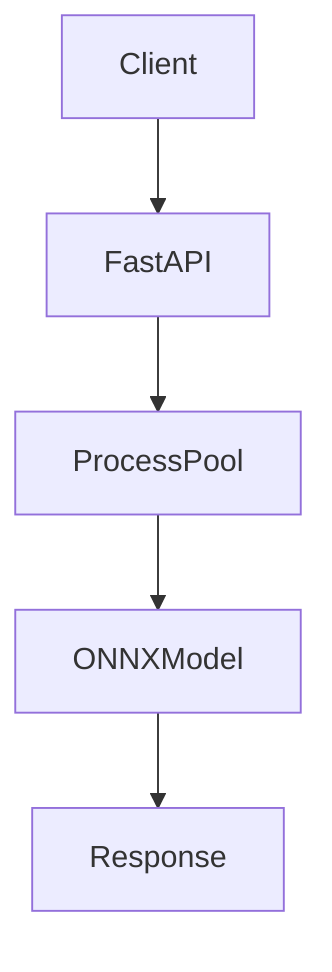
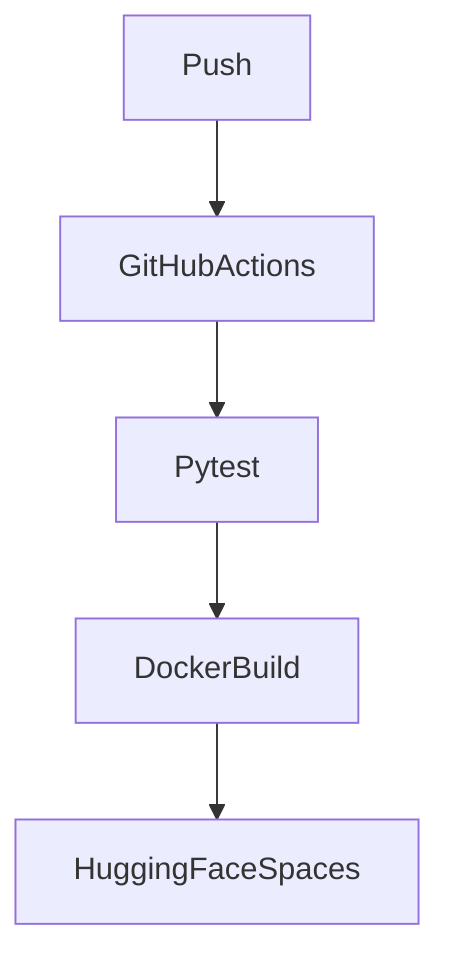

# Project Report

## Model Selection

- Model: `timm/mobilenetv4_conv_medium.e500_r224_in1k`
- Task: image classification on ImageNet-1k
- Input size: `224 x 224`
- Reason for selection: compact backbone, low CPU cost, and straightforward export to ONNX

## Optimization Phase

Run `python scripts/export_models.py` and `python scripts/benchmark_models.py --image path/to/sample.jpg` to produce the measured values below.

| Model | Size | Latency |
| --- | ---: | ---: |
| Original | TBD MB | TBD ms |
| ONNX | TBD MB | TBD ms |
| Quantized | TBD MB | TBD ms |

## Error Handling Strategy

- Missing file: `422`
- Invalid file type: `415`
- Too large file: `413`
- Corrupted image: `422`
- Unexpected server crash: `500`

Validation checks cover file extension, MIME type, upload size, and image decodability before inference starts.

## System Architecture

## CI/CD Pipeline

## Performance Testing

Load testing is intended for both local Docker and Hugging Face Spaces with JMeter against `POST /predict`. Collect throughput, request latency, and P95 latency, then identify the CPU saturation point where response time rises sharply.

## Deliverables Checklist

- FastAPI application
- Model export scripts
- Benchmarking script
- Quantized ONNX model path
- Pytest suite
- Docker packaging
- GitHub Actions workflow
- Deployment script for Hugging Face Spaces
